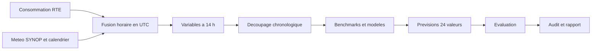

# Prévision de la consommation électrique en France métropolitaine

Projet de séries temporelles, Master 1 Informatique (Data Science), travail en binôme, 50 % de la note finale.

- Auteures et auteurs : [Prénom 1] et [Prénom 2]
- Date de rendu : [DATE DE RENDU]
- Date de l'oral : [DATE DE L'ORAL]
- Dépôt : https://github.com/MarteOued/Projet-series-temporelles

---

## Table des matières

1. [Le projet en bref](#1-le-projet-en-bref)
2. [Le problème, expliqué simplement](#2-le-problème-expliqué-simplement)
3. [La règle d'or : seulement ce qu'on sait à 14 h](#3-la-règle-dor--seulement-ce-quon-sait-à-14-h)
4. [Les données](#4-les-données)
5. [Ce que l'exploration a déjà montré](#5-ce-que-lexploration-a-déjà-montré)
6. [Les décisions du groupe](#6-les-décisions-du-groupe)
7. [La méthode](#7-la-méthode)
8. [Protocole de validation](#8-protocole-de-validation)
9. [Évaluation](#9-évaluation)
10. [Audit critique](#10-audit-critique)
11. [Organisation du dépôt](#11-organisation-du-dépôt)
12. [Installation et ordre d'exécution](#12-installation-et-ordre-dexécution)
13. [Travailler à deux](#13-travailler-à-deux)
14. [Feuille de route](#14-feuille-de-route)
15. [Usage de l'IA](#15-usage-de-lia)
16. [Limites connues et risques](#16-limites-connues-et-risques)
17. [Glossaire](#17-glossaire)
18. [Questions fréquentes](#18-questions-fréquentes)
19. [Sources](#19-sources)

---

## 1. Le projet en bref

**Problème.** Chaque jour J à 14 h (heure de Paris), prévoir la consommation électrique horaire de la France métropolitaine pour les 24 heures du jour suivant (J+1).

**Contrainte centrale.** On n'a le droit d'utiliser que l'information réellement disponible à 14 h le jour J. Utiliser autre chose s'appelle une *fuite d'information* : le score devient trop beau et ne vaut rien en vraie vie.

**Ce qu'on livre.**
- un mini-rapport de moins de 10 pages ;
- un code reproductible, avec ce README ;
- un oral de 10 minutes avec diapositives, suivi de questions qui vérifient la compréhension de chacun.

**Ce qui est évalué** (d'après le sujet) :
- la correction du protocole temporel et l'absence de fuite d'information ;
- la qualité et la reproductibilité du traitement des données ;
- la pertinence des benchmarks et la justification des modèles ;
- la qualité de l'évaluation hors échantillon ;
- l'interprétation des erreurs et la prise de recul ;
- la maîtrise du travail à l'oral ;
- l'usage transparent, vérifié et critique des agents d'IA.

> Un modèle simple, correctement évalué et bien compris peut être mieux noté qu'un modèle complexe dont le protocole est fragile.

---

## 2. Le problème, expliqué simplement

Imagine une immense cantine pour toute la France. À chaque heure, plus ou moins de monde vient manger. Ici, le plat, c'est l'électricité, et on ne peut presque pas la garder au frigo. Il faut donc en produire juste ce qu'il faut, au bon moment : trop peu, et des gens sont sans lumière ; trop, et on gaspille.

Chaque jour à 14 h, la cheffe doit annoncer : « Demain, heure par heure, voilà combien de gens viendront manger. » Cela fait **24 chiffres**, un par heure de demain.

| Mot | Sens |
|---|---|
| **J** | Aujourd'hui, le jour où l'on fait la prévision |
| **J+1** | Demain, le jour qu'on cherche à prévoir |
| **24 valeurs** | Une par heure de J+1 : 0 h, 1 h, ..., 23 h (pas 24 heures d'attente) |
| **MW** | Mégawatt, l'unité de la consommation (environ 50 000 MW en moyenne en France) |

**Exemple.** Nous sommes mardi, il est 14 h. Mardi est J, mercredi est J+1. Lundi est dans le passé : on le connaît en entier. On doit donner la consommation prévue de mercredi à 0 h, à 1 h, ..., à 23 h.

---

## 3. La règle d'or : seulement ce qu'on sait à 14 h

À 14 h mardi, je ne peux pas savoir quel temps il fera mercredi. Regarder la vraie météo de mercredi pour prédire mercredi, c'est lire la réponse au bout du cahier avant de faire l'exercice.

### Ce qui est autorisé à 14 h le jour J

| Information | Autorisée ? | Pourquoi |
|---|---|---|
| Consommation des jours passés | Oui | Tout le passé est connu |
| Consommation du jour J, jusqu'à la dernière valeur horaire connue | Oui | Déjà publiée |
| Consommation du jour J après cette heure | Non | N'existe pas encore |
| Consommation de J+1 | Non | C'est la cible |
| Météo observée jusqu'à 14 h le jour J | Oui | Déjà mesurée |
| Météo observée de J+1 | Non en scénario opérationnel | N'existe pas encore (voir ci-dessous) |
| Calendrier de J+1 (jour, férié, vacances) | Oui | Connu à l'avance |
| Autres colonnes d'éCO2mix (nucléaire, solaire, éolien, CO2, échanges) | Non | Mesurées en même temps que la consommation |
| Prévisions de RTE (`prevision_j1`, `prevision_j`) | Pas comme variable | Comparaison externe possible, à signaler |

### Deux scénarios à bien séparer

1. **Scénario opérationnel** : uniquement l'information ci-dessus. C'est la version réaliste, utilisable en vraie vie.
2. **Scénario « météo parfaite »** : on triche exprès avec la météo observée de J+1, pour connaître le meilleur score possible. Ce n'est **qu'une borne de comparaison**, jamais présentée comme déployable.

L'écart entre les deux mesure ce que coûte l'incertitude sur la météo.

### Quatre pièges à connaître

1. **La journée J est incomplète à 14 h.** Pour prédire mercredi 18 h, la valeur de mardi 18 h n'existe pas encore. On utilise lundi 18 h, ou mercredi dernier 18 h.
2. **Les autres colonnes d'éCO2mix.** La production s'ajuste à la consommation : connaître la production de demain, c'est presque connaître sa consommation.
3. **UTC et heure de Paris.** 14 h à Paris = 12 h UTC l'été, 13 h UTC l'hiver. Confondre les deux revient à utiliser des données publiées après 14 h, ou à décaler la météo et la consommation. Les jours de changement d'heure comptent 23 ou 25 heures.
4. **Pas de prévisions météo.** On n'a que des observations. Notre scénario réaliste est donc plutôt pessimiste (un vrai opérateur connaîtrait la prévision de demain), la météo parfaite plutôt optimiste (une vraie prévision peut se tromper). La vérité est entre les deux : à discuter dans le rapport.

---

## 4. Les données

On utilise trois sources, imposées par le sujet. Aucune donnée n'est stockée dans le dépôt : **tout se retélécharge avec les scripts.**

### 4.1 Consommation : éCO2mix (RTE)

- **Où** : portail Open Data Réseaux Énergies, jeu `eco2mix-national-cons-def` (données définitives et consolidées) ; jeu `eco2mix-national-tr` pour le temps réel.
- **Contenu** : consommation en MW de la France, depuis fin 2011. Pas de 15 minutes, mais la consommation n'est renseignée qu'à :00 et :30.
- **Qualité** (colonne `nature`) : *définitives* jusqu'en 2024, *consolidées* pour 2025 et 2026. Les données consolidées sont remplacées par des définitives l'année suivante.
- **Colonnes utiles** : `date_heure` (en UTC), `consommation`, `nature`.
- **À ne pas utiliser comme variables** : toutes les autres colonnes (production par filière, échanges, taux de CO2) et les prévisions de RTE.
- **Traitement** : suppression des doublons, tri, passage à l'heure par moyenne, en UTC, puis interpolation des petits trous.

### 4.2 Météo : SYNOP (Météo-France)

- **Où** : archive « Synop OMM » sur data.gouv.fr, un fichier compressé par année (`synop_{année}.csv.gz`) et une liste officielle des stations.
- **Contenu** : observations toutes les 3 heures, station par station. La variable clé est la température `t`, en kelvins (à convertir en degrés Celsius). `mq` signifie « manquant ».
- **Stations** : celles de métropole ont un identifiant inférieur à 8000. Le fichier de 2025 contient beaucoup plus de stations que les autres années ; celles qui sont absentes de la liste officielle sont ignorées.
- **Traitement** : lecture robuste (colonnes détectées, plusieurs formats de date, diagnostic du pourcentage de dates lues), filtrage par période, passage à l'heure par interpolation (les observations sont 3-horaires), moyenne nationale pondérée.

### 4.3 Calendrier (construit par nous)

- Heure, jour de la semaine, mois, week-end, jours fériés, vacances scolaires (zones A, B, C), ponts, événements exceptionnels éventuels (à justifier).
- Connu à l'avance : donc utilisable pour J+1.

### 4.4 Peut-on ajouter d'autres sources ?

Le sujet fixe ces trois sources. Pour en ajouter une, il faut répondre oui à trois questions :
1. Est-elle connue à 14 h le jour J ?
2. Peut-on la retélécharger pour reproduire les résultats ?
3. Peut-elle entrer dans le tableau de disponibilité ?

Le plus prudent : demander à l'enseignant avant. Mieux vaut bien exploiter trois sources que en empiler cinq sans maîtriser leur disponibilité.

---

## 5. Ce que l'exploration a déjà montré

Première exploration, réalisée avant la création de ce dépôt. **Ces chiffres sont des mesures de départ : les scripts du dépôt doivent les retrouver, et tout écart doit être noté** (les sources se mettent à jour).

### Consommation

| Constat | Valeur |
|---|---|
| Période disponible | du 31/12/2011 23:00 UTC au 30/06/2026 |
| Lignes brutes (jeu complet) | environ 508 000, 37 colonnes |
| Heures retenues sur 2016-2025 | 87 672 |
| Heures manquantes sur 2016-2025 | 10 (soit environ 0,01 %) |
| Moment des heures manquantes | toujours 02:00, heure de Paris, un dimanche d'octobre : c'est le changement d'heure |
| 2026 | 4 343 heures, soit 49,6 % de l'année : incomplète |

### Le niveau de consommation a changé

Écart de la consommation moyenne annuelle par rapport à 2016-2019 :

| Année | Écart | Lecture |
|---|---|---|
| 2020 | −6,4 % | Covid (hypothèse) |
| 2021 | −1,6 % | Retour presque à la normale |
| 2022 | −5,4 % | Sobriété énergétique (hypothèse) |
| 2023 | −8,5 % | Point bas |
| 2024 | −7,8 % | Niveau bas qui reste |
| 2025 | −6,7 % | Niveau bas qui reste |

Ce que cela change : un modèle qui apprend « un mercredi à 8 h, c'est 62 000 MW » sur les anciennes années se trompera toujours vers le haut. Il faut des **variables de niveau récent** (la consommation d'il y a une semaine, la moyenne des derniers jours) et une **réestimation régulière**. Les causes (Covid, sobriété) sont des *hypothèses* : les données montrent la baisse, pas ses causes.

### Météo

- 40 stations métropolitaines sur 42 sont bien couvertes (au moins 92 % des observations).
- Les 11 stations retenues ont une couverture de la température d'au moins 96 %.
- Le fichier de 2025 contient 189 stations dont une centaine sans nom dans la liste officielle, avec environ 3 % de couverture : elles sont écartées.
- Limite à noter : Paris n'est représentée que par la station d'Orly, au sud de la ville.

### Retard de publication

Une seule mesure : environ 19 minutes entre la mesure et la publication en temps réel. **À refaire vers 14 h, plusieurs jours de suite.**

---

## 6. Les décisions du groupe

Décisions proposées puis **validées par les deux membres du groupe** le 2026-10-02. Toute modification est ajoutée dans `docs/decisions.md` (sans effacer l'ancienne) et dans `src/config.py`.

| # | Décision | Raison |
|---|---|---|
| 1 | Période d'étude : **2016 à 2025** | Dix années complètes : sept pour apprendre, une pour valider, deux pour tester ; niveau de consommation plus proche de l'actuel |
| 2 | **2026 exclue**, réservée à un test bonus utilisé une seule fois à la fin | Année incomplète (fin juin), données encore consolidées et changeantes |
| 3 | Découpage : **apprentissage 2016-2022, validation 2023, test final 2024-2025** | Ordre du temps ; validation = année juste avant le test, même niveau de consommation |
| 4 | **Réestimation mensuelle**, fenêtre qui grandit, avec uniquement des données antérieures au jour prédit | Suit les changements de niveau sans trop de calcul |
| 5 | **Covid** : exclure mars à mai 2020 de l'**apprentissage seulement** ; garder 2022-2023 | Le confinement est un choc temporaire ; le niveau bas de 2022-2025 est durable |
| 6 | **Température nationale** : moyenne des 11 stations pondérée par la population de l'agglomération, comparée à la moyenne simple | Les gens consomment là où ils vivent |
| 7 | **Onze stations** : Orly (Paris), Lyon, Marignane (Marseille), Lille, Toulouse, Nantes, Strasbourg, Rennes, Montpellier, Nice, Bordeaux | Grandes agglomérations, bien réparties, couverture élevée |
| 8 | **Dernière consommation connue à 14 h** : la valeur horaire 12 h-13 h (étiquetée 12) | Une valeur étiquetée 13 couvre 13 h-14 h et n'est pas complète à 14 h ; retard de publication d'environ 20 minutes (à re-mesurer) |
| 9 | **Modèles** : benchmarks sans apprentissage ; référence apprise ; modèle simple ; modèle élaboré (gradient boosting) ; plafond (météo parfaite) | Chaque modèle répond à une question précise |
| 10 | Régression linéaire : **un modèle par heure** ; gradient boosting : **un seul modèle** avec l'heure en variable | L'effet de la température diffère selon l'heure ; les arbres gèrent les interactions |
| 11 | Heures manquantes : **interpolation linéaire**, au plus 3 heures de suite, signalée | 10 heures manquantes sur 87 672, toutes dues au changement d'heure |

### Pourquoi ce découpage (arguments à défendre)

1. **L'ordre du temps** : on prédit le futur avec le passé, comme en vraie vie. Mélanger les jours au hasard ferait « voir le futur » au modèle, et des jours voisins se ressemblent trop.
2. **Validation sur 2023** : c'est l'année la plus proche du test, avec le même niveau de consommation, et une année entière (toutes les saisons, tous les jours fériés). Valider sur 2018 reviendrait à régler le modèle pour un monde à environ 54 000 MW de moyenne alors que le test est à environ 50 000 MW.
3. **Test sur 2024-2025** : deux années récentes, soit environ 730 jours, deux hivers et deux étés. Le score est plus stable et on peut vérifier que le classement des modèles est le même d'une année à l'autre.
4. **Test jamais touché** pour choisir : sinon on règle le modèle pour lui et le score est trop optimiste.
5. **Limite à reconnaître** : une seule année de validation est fragile. On peut la renforcer par une validation glissante (apprendre 2016-2020 et valider 2021 ; apprendre 2016-2021 et valider 2022 ; apprendre 2016-2022 et valider 2023).

> On n'entraîne pas sur 2016-2025 : l'apprentissage initial est 2016-2022. Pendant le test, le modèle est réajusté chaque mois, mais seulement avec des données antérieures au jour prédit.

### Pourquoi 2016-2025 et pas 2026

2026 est incomplète : il manque tout le second semestre, donc sa moyenne n'est pas comparable à celle d'une année entière. Un test doit couvrir toutes les saisons. Ses données sont encore consolidées et vont être remplacées, donc les résultats changeraient à chaque mise à jour. 2026 sert de **bonus** : une vérification finale, utilisée une seule fois. À noter aussi : 2025 est complète mais seulement consolidée, à signaler dans le rapport.

### Décisions encore à prendre

| # | Question | Proposition de départ |
|---|---|---|
| A | Jours de 23 h et de 25 h : comment représenter les 24 valeurs de J+1 ? | À décider ensemble. Piste : prévoir par heure locale 0 à 23 et, le jour de 25 h, moyenner les deux heures répétées |
| B | Source des populations pour pondérer les stations | À choisir et documenter |
| C | Résumé des vacances scolaires (zones A, B, C) | Par exemple la part de zones en vacances |
| D | Grille d'hyperparamètres du gradient boosting | À définir sur la validation seulement |
| E | Validation glissante (2021, 2022, 2023) en plus de 2023 | Recommandée |

---

## 7. La méthode

### 7.1 Vue d'ensemble



Deux jeux de données, à ne pas confondre :
- **Jeu historique** : tout ce qui a été observé (consommation, météo, calendrier), une ligne par heure. Sert à analyser et entraîner.
- **Jeu de prévision** : pour chaque jour J, on reconstruit *artificiellement* ce qui était réellement connu à 14 h, puis on demande au modèle les 24 heures de J+1. **C'est ce deuxième niveau qui empêche les fuites.**

### 7.2 Variables construites à 14 h

Notation : on prédit l'heure h du jour J+1, à 14 h le jour J.

| Groupe | Variable | Pourquoi | Piège à éviter |
|---|---|---|---|
| Calendrier de J+1 | heure h, jour de la semaine, mois, week-end, férié, veille ou lendemain de férié, vacances | Connu à l'avance, explique l'essentiel du profil | Aucun |
| Consommation retardée | même heure h à J-1 ; même heure h une semaine avant la cible (J-6) | Le profil se répète d'un jour sur l'autre et d'une semaine sur l'autre | Ne pas utiliser J après la dernière heure connue ; J-6, pas J-7 |
| Niveau récent | moyenne de la consommation des dernières 24 h connues | Capte un niveau inhabituel et la baisse de niveau | Fixer une dernière heure connue réaliste |
| Température observée | valeur à l'origine, moyenne de la veille, moyenne des 2 à 3 derniers jours | Chauffage et climatisation suivent la température, avec de l'inertie | Jamais la température réelle de J+1 en scénario opérationnel |
| Effet non linéaire | écart à un seuil de confort (à estimer sur les données) | On consomme surtout quand il fait froid | |
| Autres variables météo | vent, nébulosité, humidité (facultatif) | Peuvent compléter la température | Même règle : observées jusqu'à 14 h |

### 7.3 Benchmarks et modèles : quelle différence ?

Un **benchmark** est une règle simple, sans apprentissage : c'est le score à battre. Un **modèle** apprend des relations à partir des données. Les deux donnent la même chose (24 valeurs pour J+1) et sont évalués de la même façon, sur les mêmes jours. Un modèle ne vaut que par son gain sur le benchmark.

| Niveau | Méthode | Apprend ? | Question à laquelle elle répond |
|---|---|---|---|
| Benchmark 1 | Même jour de la semaine, semaine précédente (J-6) | Non | Le profil hebdomadaire se répète-t-il ? |
| Benchmark 2 | Moyenne des 4 derniers mêmes jours de la semaine | Non | Moyenner réduit-il le bruit ? |
| Référence apprise | Régression linéaire : calendrier + retards | Oui, un peu | Le calendrier et l'historique suffisent-ils ? |
| Modèle simple | Régression linéaire avec météo | Oui | La météo apporte-t-elle un gain réel ? |
| Modèle élaboré | Gradient boosting (scikit-learn) | Oui, avec interactions | Les interactions non linéaires apportent-elles un gain ? |
| Plafond | Même modèle avec la météo réelle de J+1 | Oui | Combien coûte l'incertitude météo ? |

**Exemple chiffré (valeurs inventées)** : mercredi 8 h, la réalité est 56 000 MW. Le benchmark recopie mercredi dernier : 58 000 MW (erreur 2 000). Le modèle, qui voit qu'il fait plus doux, prédit 56 500 MW (erreur 500). Sur un jour, cela ne prouve rien : on compare l'erreur moyenne sur tous les jours du test. Si le modèle ne fait pas nettement mieux, **on garde le benchmark** : c'est une conclusion honnête et bien notée.

---

## 8. Protocole de validation

- Découpage **chronologique** : apprentissage 2016-2022, validation 2023, test final 2024-2025, bonus 2026.
- **Réestimation mensuelle** avec une fenêtre qui grandit, avec uniquement des données antérieures au jour prédit.
- Choix des variables et des hyperparamètres **sur la validation seulement**.
- Transformations apprises (normalisation, sélection de variables) **ajustées sur l'apprentissage seulement**.
- Simulation d'une prévision à 14 h **pour chaque jour** de la période évaluée.
- Tous les modèles sont comparés sur **les mêmes dates, avec la même information**.
- Le **test final est lancé une seule fois**, après le gel écrit des choix. Aucune modification après.
- Le bonus 2026 est utilisé une seule fois, après le test final.

### Le test de non-fuite (porte obligatoire avant toute modélisation)

On remplace toutes les données postérieures à l'origine (14 h, Paris, jour J) par du bruit ou des valeurs manquantes, puis on reconstruit les variables. **Elles doivent rester exactement identiques.** Si elles changent, une variable utilise une information qui n'était pas connue à 14 h.

---

## 9. Évaluation

### Métriques (demandées par le sujet)

| Métrique | Définition |
|---|---|
| MAE | Erreur absolue moyenne, en MW |
| RMSE | Racine de l'erreur quadratique moyenne, en MW (pénalise les grosses erreurs) |
| Erreur sur le total du jour | Écart absolu entre la consommation totale prévue et réelle de la journée |
| Erreur sur la valeur de la pointe | Écart entre le maximum prévu et le maximum réel de la journée |
| Erreur sur l'heure de la pointe | Écart, en heures, entre l'heure prévue et l'heure réelle de la pointe |

### Détail des résultats

Par saison, jours ouvrés et non ouvrés, jours fériés, conditions météo (par exemple grand froid ou forte chaleur), heures de la journée, et période (2024 contre 2025).

### Tableau final attendu

| Modèle | MAE | RMSE | Total du jour | Valeur de la pointe | Heure de la pointe |
|---|---:|---:|---:|---:|---:|
| Benchmark 1 | | | | | |
| Benchmark 2 | | | | | |
| Référence apprise | | | | | |
| Modèle simple | | | | | |
| Modèle élaboré | | | | | |
| Plafond (météo parfaite) | | | | | |

---

## 10. Audit critique

Une partie du rapport (environ 1 à 2 pages) est consacrée à la prise de recul.

### 10.1 Disponibilité de l'information

Un tableau indique, pour chaque variable : sa source, son instant de disponibilité, son caractère observé ou prévu, son utilisation dans le modèle et le risque de fuite. Il permet de répondre à : **« Cette prévision aurait-elle réellement pu être calculée à 14 h le jour J ? »** Voir `docs/disponibilite_variables.md`.

Point de vigilance : on entraîne avec des données *définitives*, alors qu'à 14 h on n'aurait que du temps réel, moins précis. C'est une différence entre la simulation et la réalité, à signaler.

### 10.2 Valeur ajoutée de la complexité

On compare au moins un benchmark, un modèle simple et un modèle élaboré, et on mesure l'apport de groupes de variables par **ablation** : retirer la météo, puis le calendrier, puis les retards, et mesurer la perte.

Comparaison à faire pour la décision 5 (Covid), sur la validation 2023 :

| Version | Données d'apprentissage |
|---|---|
| A | 2016-2022 en entier |
| B | 2016-2022 sans mars à mai 2020 |
| C | 2021-2022 seulement |

On garde la version qui a l'erreur la plus faible, et on cite les chiffres.

### 10.3 Analyse des échecs

Au moins **trois journées** à grosse erreur, chacune classée : limite des données, limite du modèle, rupture de régime, événement difficilement prévisible, ou faiblesse du protocole. Candidats : jours fériés en milieu de semaine, ponts, vagues de froid ou de chaleur, nuits de changement d'heure.

### 10.4 Robustesse et conditions d'utilisation

Le classement des modèles est-il stable selon les périodes, les métriques et les heures ? Dans quelles situations déconseille-t-on le système ?

---

## 11. Organisation du dépôt

Organisation convenue (à adapter si le dépôt réel diffère, en le notant ici) :

```text
prevision-conso-elec/
├── README.md                    Ce fichier
├── CONTRIBUTING.md              Façon de travailler à deux
├── requirements.txt             Dépendances Python
├── pytest.ini                   Configuration des tests
├── .gitignore                   Exclut données, secrets et fichiers temporaires
├── src/
│   ├── config.py                Toutes les décisions du groupe
│   ├── utils.py                 Petites fonctions utilitaires
│   ├── protocol.py              La règle des 14 h et le découpage chronologique
│   ├── data/
│   │   ├── rte.py               Consommation : téléchargement, passage à l'heure, rapport
│   │   ├── synop.py             Météo : téléchargement, lecture robuste, couverture
│   │   ├── calendrier.py        Variables calendaires
│   │   └── retard_publication.py  Mesure du retard de publication
│   ├── features/
│   │   └── build_features.py    Variables construites à 14 h, sans fuite
│   ├── models/
│   │   ├── benchmarks.py        Benchmarks sans apprentissage
│   │   └── modeles.py           Modèles avec apprentissage
│   └── evaluation/
│       └── metrics.py           MAE, RMSE, total du jour, pointe, heure de pointe
├── tests/                       Tests automatiques, dont le test de non-fuite
├── docs/
│   ├── decisions.md             Décisions, raisons, chiffres
│   ├── protocole.md             Ce qu'on a le droit d'utiliser à 14 h
│   ├── repartition.md           Qui fait quoi
│   ├── disponibilite_variables.md  Tableau d'audit
│   ├── journal_ia.md            Journal de l'usage de l'IA
│   ├── guide_pour_le_binome.md  Guide de lecture et de démarrage
│   └── explications/            Une explication par phase
├── notebooks/                   Notebooks Colab (simples enveloppes autour de src/)
├── data/
│   ├── raw/                     Fichiers bruts téléchargés (non versionnés)
│   ├── interim/                 Fichiers intermédiaires (non versionnés)
│   └── processed/               Fichiers propres (non versionnés)
└── reports/
    ├── tables/                  Tableaux produits par les scripts
    └── figures/                 Graphiques produits par les scripts
```

### Format de données commun (pour travailler en parallèle)

- Toutes les séries sont stockées en **UTC**, avec un index horaire nommé `date_heure_utc`.
- Consommation : colonne `consommation_MW` et un indicateur `interpole`.
- Météo : colonnes `numer_sta`, `date`, `t` (en degrés Celsius).
- Le calendrier et l'origine de prévision sont calculés en heure de Paris.

---

## 12. Installation et ordre d'exécution

### Dépendances

Python 3.10 ou plus récent, avec : `pandas`, `numpy`, `requests`, `matplotlib`, `scikit-learn`, `holidays`, `pytest`.

### Installation

```bash
git clone https://github.com/MarteOued/Projet-series-temporelles.git
cd Projet-series-temporelles
python -m venv .venv
source .venv/bin/activate        # Windows : .venv\Scripts\activate
pip install -r requirements.txt
```

### Ordre d'exécution

| # | Étape | Commande (convenue) | Sortie | Coût |
|---|---|---|---|---|
| 1 | Tests | `pytest` | Tous les tests passent (aucun appel réseau) | Rapide |
| 2 | Consommation | `python -m src.data.rte` | `data/processed/conso_horaire_utc.csv`, rapport annuel dans `reports/tables/` | **Coûteux** : téléchargement (1 à 2 minutes) |
| 3 | Météo | `python -m src.data.synop` | Fichiers dans `data/interim/`, couverture dans `reports/tables/` | **Coûteux** : un fichier par année, mis en cache dans `data/raw/synop/` |
| 4 | Retard de publication | `python -m src.data.retard_publication` | Une ligne ajoutée à `reports/tables/retard_publication.csv` | Rapide ; à lancer vers 14 h, plusieurs jours |
| 5 | Variables et prévisions | à définir | À compléter au fil du projet | |
| 6 | Évaluation et figures | à définir | À compléter au fil du projet | **Coûteux** : réestimation mensuelle des modèles |

Étapes potentiellement coûteuses à signaler à chaque exécution : les téléchargements (étapes 2 et 3), la réestimation mensuelle du gradient boosting sur 2024-2025, la validation glissante.

### Colab

`notebooks/00_demarrage_colab.ipynb` clone le dépôt, installe les dépendances et lance les scripts. Colab efface ses fichiers à la fermeture : les données se retéléchargent à chaque session. Ne jamais coller de jeton ou de mot de passe dans un notebook.

---

## 13. Travailler à deux

Principe : **chacun est responsable d'un domaine**, puis on assemble tout dans un pipeline commun, évalué avec exactement le même protocole. On ne coupe pas le projet en deux moitiés indépendantes.

### Répartition

| | Personne 1 : la cible | Personne 2 : les variables explicatives | Les deux ensemble |
|---|---|---|---|
| **Domaine** | Consommation et modèles de référence | Météo, calendrier et modèle élaboré | Protocole et évaluation |
| **À faire** | Données RTE, nettoyage, changement d'heure, exploration, benchmarks, modèle simple, comparaison Covid (A, B, C) | Température nationale pondérée, interpolation horaire, calendrier (fériés, vacances, ponts), gradient boosting, météo parfaite | Définition de « connu à 14 h », variables à 14 h, test de non-fuite, découpage, métriques, ablation, trois jours d'échec, audit, rapport, oral |
| **Responsabilité** | Comprendre et construire correctement la variable qu'on prédit | Construire les informations qui peuvent améliorer la prévision | Un pipeline unique, défendable à l'oral |

### Méthode de travail

- **Une branche par sujet** : `data/rte`, `data/meteo`, `features/calendrier`, `models/benchmarks`, `models/boosting`, `docs/rapport`... Jamais de travail direct sur la branche principale.
- **Relecture croisée** : on ouvre une Pull Request, et **l'autre personne relit et lance le code avant de valider**. On ne valide jamais sa propre Pull Request.
- **Échange d'explications** : à la fin de chaque phase, celui qui n'a pas écrit le code se le fait expliquer, puis pose trois questions. L'oral vérifie la compréhension de chacun : chacun doit pouvoir expliquer **tout** le pipeline.
- **Deux points de 20 minutes par semaine** : ce qui est fait, ce qui bloque, les décisions à prendre.

### Checklist avant chaque Pull Request

- [ ] Le code tourne depuis zéro (les données se retéléchargent).
- [ ] Aucune variable ne dépend d'une information postérieure à 14 h.
- [ ] Le test final (2024-2025) et l'année bonus n'ont pas été utilisés.
- [ ] `pytest` passe.
- [ ] `docs/decisions.md` est à jour.
- [ ] `docs/journal_ia.md` est à jour s'il y a eu un usage notable de l'IA.

### Ce qu'on ne commite jamais

Les données (déjà exclues par `.gitignore`), les mots de passe, les jetons, les clés.

---

## 14. Feuille de route

Durées en séances de 2 à 3 heures, à ajuster selon [DATE DE RENDU].

| Phase | Objectif | Livrable | Séances |
|---|---|---|---|
| 0. Aligner | Valider les décisions à deux, créer le dépôt et le journal de l'IA | `docs/decisions.md` validé | 1 |
| 1. Données | Scripts reproductibles : consommation, météo, interpolation, fichiers propres, graphique hebdomadaire 2019 contre 2020 (creux du confinement) | Fichiers propres, rapports de couverture | 1 |
| 2. Variables | Température nationale pondérée, calendrier, retards sans fuite, règle de la dernière heure connue | Fonction de construction des variables à 14 h, test de non-fuite | 2 |
| 3. Benchmarks et évaluation | Boucle de simulation à 14 h, benchmarks, métriques, résultats par saison | Scores des benchmarks sur 2023 | 2 |
| 4. Modèles | Régression avec calendrier et retards, avec météo, gradient boosting, météo parfaite, ablation, comparaison Covid, réglages sur 2023 | Tableau comparatif sur la validation | 3 à 4 |
| 5. Test final | Geler les choix par écrit, lancer **une seule fois** sur 2024-2025, puis le bonus 2026 | Résultats finaux | 1 |
| 6. Audit | Tableau de disponibilité, ablation, trois jours d'échec, robustesse, conditions d'utilisation | Section d'audit | 2 |
| 7. Rendu | Rapport de moins de 10 pages, README, diapositives, répétition de l'oral avec questions croisées | Dossier final | 3 |

### Les trois portes à ne pas franchir trop vite

1. **Avant de modéliser** : le test de non-fuite passe.
2. **Avant le test final** : tous les choix sont écrits et figés, et chacun peut les expliquer.
3. **Après le test final** : on ne modifie plus rien. Changer un modèle après avoir vu le test serait une triche involontaire.

### État d'avancement

- [x] Compréhension du sujet
- [x] Exploration des données (consommation et météo)
- [x] Décisions principales validées à deux
- [ ] Création du dépôt et des scripts
- [ ] Fichiers propres reproduits depuis zéro
- [ ] Retard de publication re-mesuré vers 14 h
- [ ] Variables à 14 h et test de non-fuite
- [ ] Benchmarks et évaluation sur 2023
- [ ] Modèles, ablation, comparaison Covid
- [ ] Test final
- [ ] Audit
- [ ] Rapport, README final, oral

---

## 15. Usage de l'IA

L'usage d'agents conversationnels et d'assistants de programmation est **autorisé**, mais il ne dispense pas de comprendre, vérifier et pouvoir expliquer tout le travail. Le groupe reste responsable du code exécuté, des méthodes, de l'absence de fuite d'information, de l'exactitude des résultats et de l'interprétation.

Le rapport doit présenter **trois exemples documentés** :
1. une proposition d'un agent **conservée** après vérification ;
2. une proposition **modifiée ou rejetée** ;
3. une **erreur, faiblesse ou réponse trompeuse détectée**.

Pour chacun : la tâche demandée, la proposition obtenue, la décision, la méthode de vérification. Le journal est tenu dans `docs/journal_ia.md` **dès le début**. Trois entrées de départ (à vérifier et réécrire avec nos mots) :
- une première lecture des fichiers SYNOP ne trouvait aucune station : remplacée par une lecture robuste avec diagnostic (100 % de dates lues) ;
- un retard de publication estimé à 1 à 2 heures d'après un site tiers : remplacé par une mesure directe d'environ 19 minutes ;
- l'exclusion de 2026 de l'étude, conservée après vérification (49,6 % de l'année).

---

## 16. Limites connues et risques

| Limite ou risque | Conséquence | Parade |
|---|---|---|
| Pas de prévisions météo, seulement des observations | Scénario opérationnel pessimiste, météo parfaite optimiste | La discuter dans le rapport |
| Entraînement sur données définitives, usage réel sur du temps réel | Écart entre simulation et réalité | La signaler dans l'audit |
| Une seule année de validation | Choix de réglages fragile | Validation glissante |
| Paris représentée par Orly seulement | Température parisienne possiblement biaisée | La mentionner |
| Retard de publication mesuré une seule fois | Dernière heure connue possiblement mal fixée | Re-mesurer vers 14 h, plusieurs jours |
| Causes du changement de niveau (Covid, sobriété) non démontrées | Interprétation fragile | Les citer comme hypothèses |
| 2025 seulement consolidée | Légère incertitude sur la qualité | La signaler |
| Un seul membre comprend une partie | Mauvaise défense à l'oral | Échanges d'explications à chaque phase |
| Colab qui se déconnecte | Perte de fichiers | Tout retélécharger via les scripts, sauvegarder sur Drive |
| Fuite d'information | Score trop beau, rapport invalide | Test de non-fuite avant toute modélisation |

---

## 17. Glossaire

| Terme | Définition |
|---|---|
| **J, J+1** | Jour de la prévision, jour prévu |
| **Fuite d'information** | Utiliser sans le vouloir une donnée qu'on ne connaîtrait pas encore à 14 h |
| **Benchmark** | Règle simple sans apprentissage, score à battre |
| **Modèle** | Méthode qui apprend des relations à partir des données |
| **Gradient boosting** | Modèle d'arbres de décision successifs qui corrigent les erreurs des précédents |
| **Régression linéaire** | Modèle qui prédit une valeur comme une somme pondérée de variables |
| **Retard (lag)** | Valeur passée d'une variable utilisée comme variable explicative |
| **Ablation** | Retirer un groupe de variables pour mesurer sa contribution |
| **Réestimation** | Refaire l'apprentissage régulièrement avec les nouvelles données passées |
| **Validation glissante** | Plusieurs découpages apprentissage/validation successifs dans le temps |
| **Hyperparamètre** | Réglage d'un modèle choisi par nous (et non appris), à fixer sur la validation |
| **MW** | Mégawatt, unité de puissance |
| **UTC** | Heure universelle, sans changement d'heure |
| **éCO2mix** | Données de consommation et de production publiées par RTE |
| **SYNOP** | Observations météorologiques de Météo-France, toutes les 3 heures |
| **Données définitives, consolidées, temps réel** | Trois niveaux de qualité des données de RTE, du plus fiable au plus rapide |
| **Pointe** | Maximum de consommation de la journée |
| **Interpolation** | Estimer une valeur manquante à partir des valeurs voisines |

---

## 18. Questions fréquentes

**À 14 h le jour J, quelles données a-t-on le droit d'utiliser ?**
Le passé de la consommation, la consommation du jour J jusqu'à la dernière heure connue, la météo observée jusqu'à 14 h et le calendrier de J+1.

**Pourquoi la météo réelle de J+1 est-elle interdite, et à quoi sert la météo parfaite ?**
Elle n'existe pas encore à 14 h : l'utiliser est une fuite. La météo parfaite sert seulement de plafond de comparaison, pour mesurer ce que coûte l'incertitude météo. Elle n'est jamais présentée comme déployable.

**Pourquoi ne mélange-t-on pas les jours au hasard pour faire train et test ?**
Le modèle verrait des jours situés après des jours de test, et des jours voisins se ressemblent beaucoup : le score serait trop beau.

**Et si notre modèle complexe bat à peine le benchmark ?**
Sa complexité n'est pas prouvée : on garde le modèle simple, après avoir vérifié que le gain est stable selon les saisons, les jours fériés et les heures. Cette conclusion honnête est valorisée par le sujet.

**Pourquoi la dernière consommation connue est-elle celle de 12 h-13 h et pas celle de 13 h-14 h ?**
Une valeur horaire étiquetée 13 couvre 13 h à 14 h : à 14 h pile, elle n'est pas complète, et avec un retard de publication d'environ 20 minutes, elle n'est pas encore publiée.

**Pourquoi mars à mai 2020 est-il exclu de l'apprentissage ?**
Le premier confinement est un choc temporaire : un modèle qui l'apprend retiendrait un comportement qui ne reviendra pas. Il n'est exclu que de l'apprentissage, jamais de la validation ni du test, donc l'évaluation n'est pas touchée. On le justifie par la comparaison A, B, C sur 2023.

**Peut-on utiliser des prévisions météo ?**
Le sujet fournit des observations. Une prévision archivée serait plus réaliste mais difficile à retrouver et à reproduire : à discuter comme limite ou perspective, après avis de l'enseignant.

**Que fait-on d'un jour de 23 h ou de 25 h ?**
C'est la décision A, encore à prendre. Piste : prévoir par heure locale et, le jour de 25 h, moyenner les deux heures répétées.

---

## 19. Sources

- Sujet du projet : *Données temporelles, Projet de prévision, Consommation électrique en France métropolitaine* (PDF joint à l'énoncé).
- Consommation, données définitives et consolidées : https://opendata.reseaux-energies.fr/explore/dataset/eco2mix-national-cons-def
- Consommation, temps réel : jeu `eco2mix-national-tr` sur le portail https://opendata.reseaux-energies.fr (aussi sur data.gouv.fr)
- Météo, archive Synop OMM : https://www.data.gouv.fr/datasets/archive-synop-omm
- Liste des stations SYNOP (fournie avec l'archive) : colonnes ID, Nom, Latitude, Longitude, Altitude
- Jours fériés en France métropolitaine : https://data.gouv.fr/en/datasets/jours-feries-en-france-metropolitaine
- Calendrier scolaire (vacances par zone) : https://data.education.gouv.fr/explore/dataset/fr-en-calendrier-scolaire/

Les adresses des jeux de données peuvent changer : en cas de lien mort, chercher le nom du jeu sur le portail concerné.
