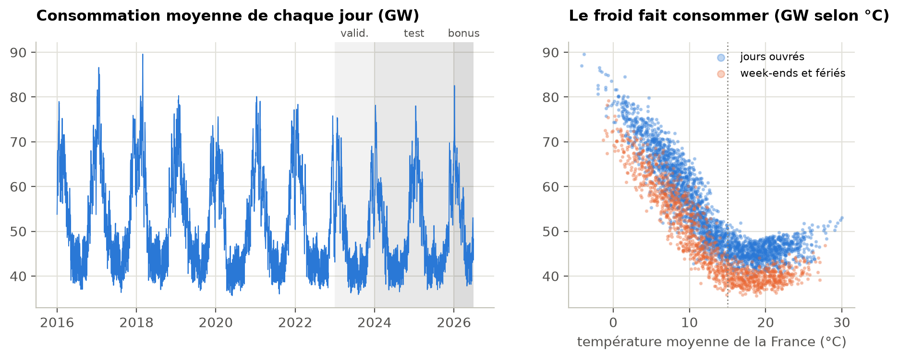
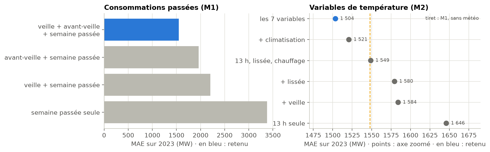
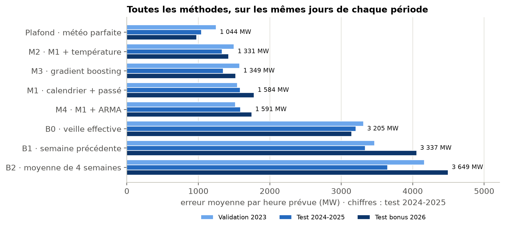
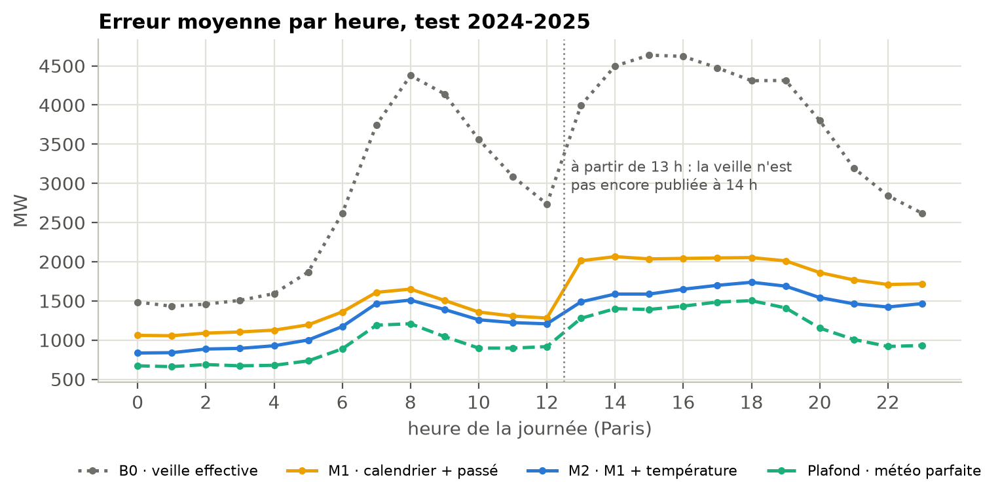
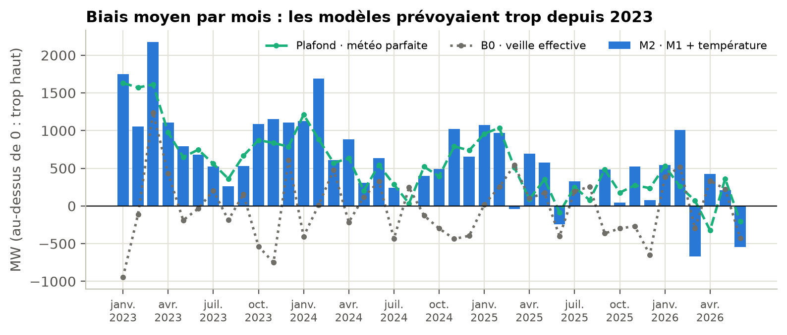
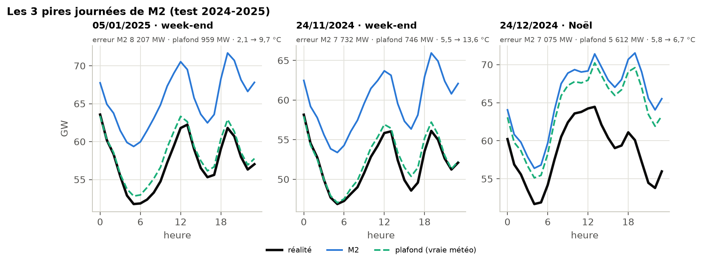

# 1. Le problème et la règle des 14 h

Chaque jour J à 14 h (heure de Paris), il faut prévoir les 24 valeurs horaires de la consommation
électrique de la France métropolitaine du jour J+1. La règle centrale est de **n'utiliser que
l'information réellement disponible à 14 h** :

- **consommation** : connue jusqu'à la tranche 12 h-13 h du jour J. La tranche 13 h-14 h se termine à
  14 h pile et n'est pas encore publiée. Pour prévoir les heures 13 à 23 du lendemain, la valeur la plus
  récente à la même heure est donc celle de l'avant-veille ;
- **météo** : observations jusqu'à 13 h (12 h UTC en hiver, 9 h UTC en été). Nous n'avons **pas de
  prévision météo** : c'est la principale limite du projet ;
- **calendrier** du lendemain : connu à l'avance.

Deux scénarios sont séparés : le scénario **opérationnel**, le seul présenté comme utilisable, et un
**plafond « météo parfaite »** qui ajoute la vraie température du lendemain, uniquement pour mesurer ce
qu'apporterait une prévision météo.

**Découpage chronologique** (jours cibles) : apprentissage 2016-2022, validation 2023 (tous les choix),
test 2024-2025 (jugement), puis un **test bonus** sur janvier-juin 2026, lancé une seule fois.

# 2. Les données

| Donnée | Source | Traitement principal |
|---|---|---|
| Consommation | RTE, éCO2mix national (versions définitives jusqu'en 2024, consolidées en 2025) | Passage de la demi-heure à l'heure en UTC ; « lignes fantômes » des passages à l'heure d'été retirées ; 10 heures manquantes interpolées (colonne `interpole`), toutes à 2 h du matin le jour du passage à l'heure d'hiver |
| Température | Météo-France, observations SYNOP toutes les 3 h | 40 stations présentes chaque année de 2015 à 2025 pour nettoyer ; 38 stations continentales pour la température France (la consommation RTE est exactement la somme des 12 régions continentales, sans la Corse) |
| Calendrier | Jours fériés, ponts, vacances scolaires A, B, C | Construit par le groupe, connu à l'avance |

**Changements d'heure.** Tout est stocké en UTC et prévu en heure de Paris. Les 20 jours de 23 h ou 25 h
(2 par an) ne sont jamais notés, mais restent utilisables comme passé.

**Trous et anomalies météo.** Les valeurs manquantes sont reconstruites **sans regarder le futur** : par
les stations voisines au même instant, puis par le passé de la station (persistance, veille, persistance
ajustée). La méthode est choisie par longueur de trou sur 2016-2022 seulement. Une règle apprise sur
2016-2022 (saut de plus de 15 °C en 3 h **et** écart aux voisines plus grand que tout ce qui a été vu à
l'apprentissage) retrouve, sans connaître les dates, les deux mesures aberrantes connues (Marignane
le 9/08/2023, Saint-Girons le 23/09/2025).

**Agrégation spatiale.** Trois températures France ont été préparées et comparées sur 2023 : moyenne de
8 grandes villes, moyenne simple des 38 stations, et moyenne par région pondérée par la consommation
régionale de 2016-2022. Elles sont **à égalité** (moins de 1 MW d'écart) ; la pondérée est retenue, car
c'est la plus justifiée (l'Île-de-France pèse 14,8 % de la consommation pour une seule station).

**Ce que montre l'exploration (2016-2022).** Sous 15 °C, la consommation augmente d'environ 2 400 MW par
degré en moins (chauffage électrique) ; au-dessus de 22 °C, elle remonte un peu (climatisation). Les
jours fériés consomment environ 11 % de moins, les ponts 8 %, et la consommation baisse fortement en
août. Une **rupture de niveau** apparaît depuis l'hiver 2022-2023 (sobriété énergétique).

# 3. Les méthodes, de la plus simple à la plus élaborée

Chaque méthode répond à une question précise.

| Méthode | Question | Ce qu'elle utilise |
|---|---|---|
| **B0** veille effective | La consommation récente suffit-elle ? | Jour J pour les heures 0-12, J-1 pour 13-23 |
| **B1** semaine précédente | Le rythme hebdomadaire suffit-il ? | Même jour de la semaine précédente |
| **B2** moyenne de 4 semaines | Une moyenne lisse-t-elle mieux ? | Moyenne des 4 mêmes jours précédents |
| **M1** régression | Le calendrier et le passé suffisent-ils ? | Retards 24 h (si H ≤ 12), 48 h, 168 h ; jour de la semaine, mois, fériés et voisins, ponts, vacances |
| **M2** régression + météo | La température aide-t-elle ? | M1 + 7 variables de température : à 13 h, la veille, lissée sur plusieurs jours, degrés de chauffage (sous 15 °C) et de climatisation (au-dessus de 22 °C) |
| **M3** gradient boosting | Un modèle plus souple fait-il mieux ? | Exactement les variables de M2 |
| **M4** M1 + ARMA | Les erreurs se répètent-elles ? | M1 corrigé par un AR(1) sur ses erreurs passées connues à 14 h |
| **Plafond** | Que vaudrait une météo parfaite ? | M2 + vraie température du lendemain (non déployable) |

**Forme des modèles.** Un modèle par heure cible (24 modèles), car l'effet du lundi ou du froid n'est pas
le même à 4 h et à 19 h. Cette décision a été testée sur 2023 : 24 modèles font 1 548 MW d'erreur
moyenne, un seul modèle avec l'heure en variable 2 096 MW.

**Protocole.** Les modèles sont **réappris à chaque bloc** avec tous les jours cibles antérieurs au bloc
(fenêtre qui grandit), sans les jours du premier confinement (17 mars - 17 mai 2020) : chaque trimestre
sur la validation 2023, **chaque mois** sur le test et le test bonus. Toutes les transformations
apprises (imputation, seuils, poids régionaux) n'utilisent que 2016-2022.

**Absence de fuite, vérifiée.** Un test automatique construit les variables d'un jour, remplace par des
valeurs absurdes tout ce qui suit 14 h, reconstruit, et exige des variables identiques. Il a été vérifié
en introduisant exprès deux fausses fuites : il les attrape. Ajouter six mois de 2026 aux données laisse
celles de 2016-2025 identiques à l'octet près. Le projet compte plus de 500 tests automatiques.

**Choix faits sur 2023 seulement** (tableau `report/tables/tab4_choix_sur_2023`) :

- les **retards** sont l'ingrédient majeur : sans la veille et l'avant-veille, l'erreur de M1 double
  (3 378 MW avec la semaine passée seule, contre 1 548 MW) ;
- la **température seule** fait moins bien que M1 (1 646 MW) ; ce sont les degrés de chauffage et la
  température lissée qui aident (1 504 MW avec les 7 variables) ;
- les vacances scolaires apportent peu, la période de Noël rien en moyenne (non retenue) ;
- M3 : 4 réglages fixés à l'avance, le plus simple gagne (15 feuilles, 300 étapes, pas 0,05) ;
  M4 : l'AR(1) gagne parmi 4 ARMA.

# 4. Résultats

Toutes les méthodes sont notées **sur les mêmes jours** : ceux où chacune a ses 24 heures (723 jours sur
2024-2025). Mesures : erreur absolue moyenne (MAE), RMSE, erreur relative, biais, erreur sur l'énergie du
jour, erreur sur la pointe et sur son heure.

| Méthode | MAE 2023 (MW) | MAE 2024-2025 (MW) | MAE 2026 (MW) | MAPE 2024-2025 |
|---|---:|---:|---:|---:|
| B0 · veille effective | 3 313 | 3 205 | 3 147 | 6,4 % |
| B1 · semaine précédente | 3 468 | 3 337 | 4 054 | 6,2 % |
| B2 · moyenne de 4 semaines | 4 162 | 3 649 | 4 497 | 6,9 % |
| M1 · calendrier + passé | 1 547 | 1 584 | 1 780 | 3,0 % |
| **M2 · M1 + température** | **1 500** | **1 331** | **1 424** | **2,6 %** |
| M3 · gradient boosting | 1 580 | 1 349 | 1 524 | 2,6 % |
| M4 · M1 + ARMA | 1 520 | 1 591 | 1 747 | 3,0 % |
| Plafond · météo parfaite | 1 251 | 1 044 | 974 | 2,1 % |

**Lecture.** Tous les modèles font au moins deux fois mieux que les benchmarks. **M2** a la plus petite
erreur des modèles utilisables : 1 331 MW en 2024-2025, soit 2,6 % de la consommation, environ la
puissance d'un réacteur nucléaire, et 2,4 fois moins que B0. Le résultat tient sur 2026, jamais vu
(1 424 MW). Une prévision météo parfaite ferait gagner encore 17 à 32 % selon la période.

**Les écarts sont-ils réels ?** Test de Diebold-Mariano sur l'erreur de chaque jour (tableau
`tab3_significativite_diebold_mariano`). Sur le test, M2 bat nettement M1 et M4 (p < 0,001), mais **M2 et
M3 sont à égalité** pour la MAE (p = 0,60 ; chacun gagne la moitié des jours ; p = 0,050 pour le RMSE).
M3 est meilleur en été et sur l'énergie du jour, M2 en hiver. Nous présentons M2 non parce qu'il serait
« le meilleur », mais parce qu'à précision égale il est plus simple, explicable, meilleur l'hiver (saison
la plus importante pour le réseau) et plus stable que M3 entre la validation et le test.

**Où se trouvent les erreurs** (figure 3, tableau `tab5_erreurs_par_groupe_test`). L'erreur de M2 est
deux fois plus grande en hiver qu'en été (2 017 contre 940 MW) et la plus forte par grand froid. Elle
**saute à 13 h** : à partir de cette heure, la consommation de la veille à la même heure n'est pas encore
publiée. Les fériés, les ponts et la période de Noël restent difficiles.

**Un défaut commun : la surestimation.** Tous les modèles prévoient trop en moyenne depuis 2023 (biais de
M2 : +1 012 MW en 2023, +518 MW sur le test, +158 MW en 2026), même le plafond : ce n'est donc pas la
météo. Notre hypothèse est la baisse de niveau due à la sobriété énergétique, que des modèles appris sur
des années plus consommatrices rattrapent lentement. Nous ne l'avons pas corrigée : elle a été
découverte sur le test.

# 5. Audit critique

**5.1 Disponibilité des variables à 14 h** (détail : `docs/disponibilite_variables.md`)

| Variable | Disponible à 14 h le jour J ? | Utilisée par | Risque |
|---|---|---|---|
| Consommation 24 h avant l'heure cible | Oui pour H ≤ 12 ; sinon 48 h avant | M1 à M4 | Version consolidée, plus propre que le temps réel du jour |
| Consommation 48 h et 7 jours avant | Oui | M1 à M4 | Idem |
| Erreur de M1 de la veille (M4) | Oui pour H ≤ 12 ; sinon l'avant-veille | M4 | **Fuite trouvée et corrigée** (l'heure 13 utilisait une valeur non publiée) |
| Température à 13 h, de la veille, lissée ; degrés de chauffage et de climatisation | Oui : observations jusqu'à 13 h | M2, M3 | Imputation causale, paramètres appris sur 2016-2022 |
| Calendrier du lendemain | Oui, connu à l'avance | Tous | Nul |
| Température réelle du lendemain | **Non** | Plafond seulement | Non déployable, présenté comme repère |
| Prévision météo du lendemain | Existe à 14 h, mais pas dans nos données | Aucun | Principale amélioration possible |

**5.2 Valeur ajoutée de la complexité (ablation).** Passer de B0 à M1 divise l'erreur par deux : le
calendrier et les bons retards font l'essentiel. La température ajoute un gain net sur le test (M1 →
M2 : de 1 584 à 1 331 MW, p < 0,001), mais pas significatif en 2023, année où elle aide peu. Un modèle
plus souple (M3) n'apporte pas de gain significatif : il déplace les erreurs de l'hiver vers l'été. La
correction des erreurs (M4) n'apporte rien : les erreurs de M1 ne se répètent qu'à 0,24-0,28 d'un jour au
suivant, et plus du tout à deux jours.

**5.3 Trois journées d'échec, classées dans la grille de l'énoncé**

| Jour | Erreur M2 | Avec la vraie météo | Catégorie | Explication |
|---|---:|---:|---|---|
| Dim. 5/01/2025 | 8 207 MW | 959 MW | Limite des données | Redoux de 2,1 à 9,7 °C non anticipé : pas de prévision météo à 14 h |
| Dim. 24/11/2024 | 7 732 MW | 746 MW | Limite des données | Redoux de 5,5 à 13,6 °C, même cause |
| Mar. 24/12/2024 | 7 075 MW | 5 612 MW | Limite du modèle | Veille de Noël : même la vraie météo n'aide pas ; la variable « période de Noël » avait été écartée car inutile en moyenne sur 2023 |

Les trois pires jours du test bonus 2026 sont aussi des redoux (la vraie météo divise l'erreur par 3 à 4).
Un autre cas révélateur : un **férié qui tombe un dimanche** (14 juillet 2024) fait prévoir beaucoup trop
bas aux modèles linéaires, qui additionnent les effets « dimanche » et « férié » ; M3 n'a pas ce défaut.

**5.4 Robustesse du classement.** Le classement est le même en 2023, 2024-2025 et 2026 pour les grandes
familles : benchmarks loin derrière, puis M1 et M4, puis M2 et M3. Seul M3 bouge (dernier des modèles en
2023, au coude-à-coude avec M2 ensuite). Par trimestre, M2 gagne tous les hivers et automnes, M3 les
étés.

**5.5 Quand ne pas utiliser le modèle.** Lors des changements brusques de température (redoux, vagues de
froid), des jours de fin d'année et des fériés (surtout un férié tombant un week-end), et lorsque le
niveau de consommation change (crise de l'énergie).

**5.6 Limites que nous déclarons**

- Le test 2024-2025 de M1 et M2 a été lancé **avant** que M3 et M4 soient construits : leurs réglages
  viennent de 2023 seulement, mais nous connaissions déjà le score de M2.
- Le test de M4 a été relancé une fois, uniquement pour corriger la fuite de l'heure 13.
- Le test de sensibilité au confinement, fait après le gel, montre que garder ces jours aurait été
  meilleur sur 2023 (M2 : 1 411 au lieu de 1 504 MW). La décision n'a pas été changée.
- Les choix reposent sur une seule année de validation (2023, atypique) ; une validation glissante
  (2021, 2022, 2023) aurait été plus solide. Le meilleur réglage de M3 est au bord de la grille.
- Le jour qui précède chaque bloc est appris en entier alors que son après-midi n'est pas connu à 14 h
  (11 heures sur environ 60 000 jours-heures : effet négligeable).
- Les données de consommation sont consolidées ou définitives, plus propres que celles disponibles le
  jour même : nos erreurs sont sans doute un peu optimistes.

**Améliorations, par ordre d'impact attendu :** une prévision météo du lendemain (jusqu'à 22 % d'erreur en
moins sur le test d'après le plafond) ; suivre le niveau récent (tendance, ou plus de poids aux années
récentes) ; utiliser la consommation du jour J jusqu'à 12 h pour les heures de l'après-midi ; traiter à
part les jours spéciaux (veille de Noël, férié du week-end) ; une validation glissante.

# 6. Usage de l'intelligence artificielle

Nous avons utilisé un assistant de code (Claude Code). Le journal complet est dans `docs/journal_ia.md`.

**Martine**

1. *Proposition conservée après vérification* : le test de non-fuite de la table des variables. Vérifié
   par deux fausses fuites introduites exprès ; la première n'était pas détectée car placée dans une
   fonction que le calcul réel n'utilise pas, ce qui a obligé à refaire la vérification correctement.
2. *Proposition rejetée* : prolonger toute la période du projet jusqu'en 2026 pour le test bonus,
   contraire à notre décision 1. Les données de 2026 ont été rangées à part ; nous avons vérifié que
   les données 2016-2025 restaient identiques.
3. *Erreur détectée* : des commentaires de résultats écrits avant de voir les sorties (« classement
   identique en 2024 et 2025 », « 2,5 fois moins d'erreur ») ; relus face aux sorties et corrigés.

**Khadim**

1. *À compléter.*
2. *À compléter.*
3. *À compléter.*

# 7. Reproduire le projet

Le code, les tests et les résultats sont dans le dépôt
<https://github.com/MarteOued/Projet-series-temporelles>. Le README donne l'ordre des commandes, de la
consommation (`python -m src.rte`) jusqu'aux tableaux et figures de ce rapport (`python -m src.rapport`).
Un tableau de bord (`streamlit run app/tableau_de_bord.py`) présente tous les résultats.
